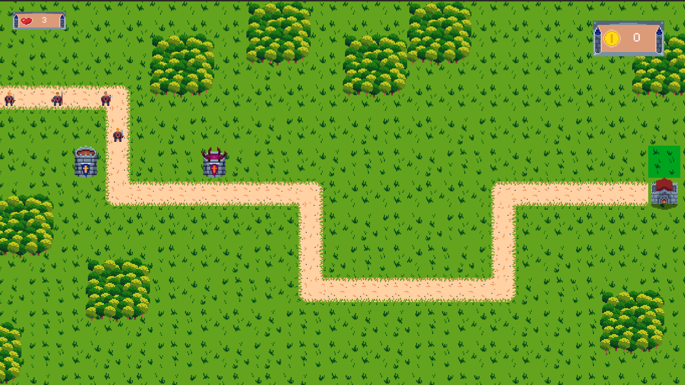
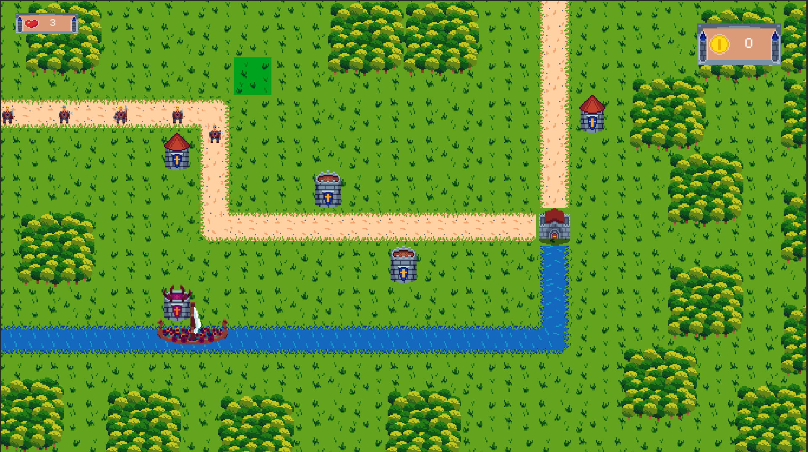
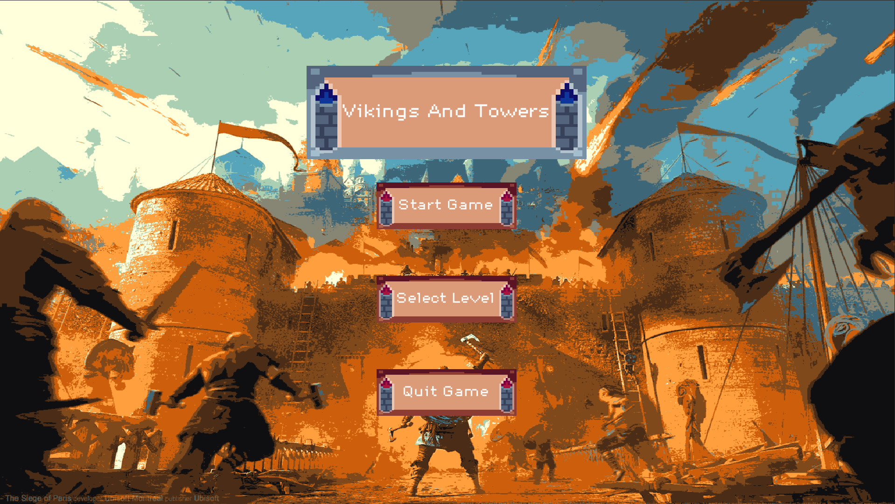
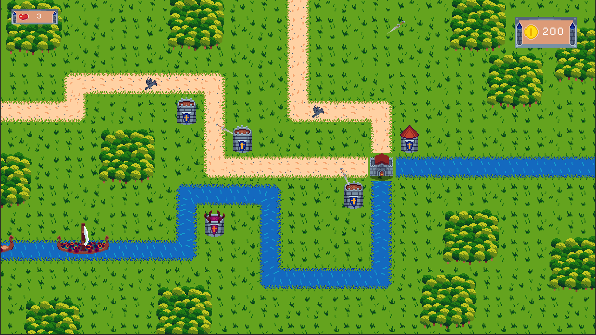

Viking and Towers is een Tower Defence game waar jij de torens plaast om de vikings tegen te houden van het binnen komen in je fort.
je plaast de torens met het geld wat je hebt om meer geld te krijgen moet je de vikings vernietigen. De vikings zullen niet alleen op land komen maar ook via de riviers.

## Product 1: "DRY SRP Scripts op GitHub"

in het wave script werk ik met SRP
[Wave_Script](Tower_Defence_Game/Assets/Scripts/Wave_Scripts/Wave_Script.cs)

in de Tower Script werk ik met DRY
[Tower-Script](Tower_Defence_Game/Assets/Scripts/Tower_Scripts/Towers_Script.cs)

## Product 2: "Projectmappen op GitHub"

dit zijn alle mappen die gerbuik in mijn unity voor dit project. Alles is goed neer gezet zodat het duidelijk is waar alles is
[Project Mappen](Tower_Defence_Game/Assets)

## Product 3: Build op Github

[Vikings And Towers Realse](https://github.com/Luuk-Gunnewijk/SD2B_Tower_Defence_Game/releases/tag/1.0)

## Product 4: Game met Sprites(animations) en Textures 

voor mijn game heb ik alle sprites zelf gemaakt in aseprite en allemaal in unity gezet. voor animaties heb ik sprite sheets gebruikt en voor de single foto's heb ik een sprite gebruikt. ik heb ook een texture zodra de enemies damage nemen.

[Texture](Tower_Defence_Game/Assets/Graphics/Materials/WhiteMat.mat)

## Product 5: Issues met debug screenshots op GitHub 

er zijn verschillende manieren om te debugen. 

Als voorbeeld:

in dit script zie je dat ik bijvoorbeeld debug.log gebruik.
[Main Economy_Script](Tower_Defence_Game/Assets/Scripts/Economy_Scripts/Main_Economy_Script.cs)

ik heb ook draw raycast gerbuikt ook een manier van debugen.
daarmee kon ik makkelijk zien waar de toren naar aan het richten is.

je kan ook manieren gebruiken om de code te stoppen en daar de coden te open om te kijken wat daar gebeurd.

## Product 6: Game design met onderbouwing 

als eerst heb ik een one page gemaakt
[onePage](https://app.milanote.com/1QEZGp1tOjdeaP/one-page)

ik heb ook zelf bedacht van tevoren hoe ik wil dat de game voelt de twee belangrijkste doelen waren om te zorgen dat de stratigichs begint en daarna chaotich word.

*  **Je game bevat torens die kunnen mikken en schieten op een bewegend doel.** 

mijn torens kunnen schieten op de vijand dee het meest ver op het pad is en in hun range staat. als ze op de vijanden schiten krijgen de vijanden damage als ze raaken

*  **Je game bevat vernietigbare vijanden die 1 of meerderen paden kunnen volgen.**  

mij vijanden volgen een pad die ik makkelijk kan veranderen. als ze het forst aanraken doen ze damage op de main health. als projecttiles hun raken doet dat damage op de vijand verschillende projecttiles doen verschillende strekte damage

*  **Je game bevat een “wave” systeem waarmee er onder bepaalde voorwaarden (tijd/vijanden op) nieuwe waves met vijanden het veld in komen.**

in mijn wave systeem word de volgende wave gespawnt als de vorige wave leeg is. in de wave kan ik de tijd bepalen van de enemies en de padden en welke enemies ik wil spawnen.

*  **Een “health” systeem waarmee je levens kunt verliezen als vijanden hun doel bereiken en zodoende het spel kunt verliezen.** 

als vijanden het fort berijken gaat er health af van de main health is de health nul begint het level opnieuw

*  **Een “resource” systeem waarmee je resources kunt verdienen waarmee je torens kunt kopen en .evt upgraden.**

je begint met geld om torens te kunnen plaasten. als je een toren plaast dan gaat er geld van af. als je enemies dood krijg je er geld bij. je krijgt meer geld van verschillende enemies

*  **Een “upgrade” systeem om je torens te verbeteren.**

ik heb geen upgrade systeem voor de torens

*  **Een “movement prediction” systeem waarmee je kan berekenen waar een toren heen moeten schieten om een bewegend object te kunnen raken. (Moeilijk)**

mijn torens zien welke enemy het verst is op het pad en ook in hun range staat als ze er een zien gaan ze schieten

## Product 7: Class Diagram voor volledige codebase 

## Product 8: Prototype test video

Voor het testen van mij game heb ik gewerkt met andere leerlingen en heb ik een van mijn vrienden gevraagt of hij mij game kon spelen hier is de video van hoe dat ging

[PlayTest Video](https://www.youtube.com/watch?v=bxJfzeybbpQ)

## Product 9: SCRUM planning inschatting 

Voor mijn pellning en mijn one page gebruik ik milanote in plaast van trello. ik heb een plenning gemaakt user story's hoe ik bepaalde code kan aanpakken en een one page hier op gemaakt.

[Milanote](https://app.milanote.com/1QExQw1aKhg17j/bo)

## Product 10: Gitflow conventions

GitFlow is mij zelf helaas niet helemaal gelukt om voor elkaar te krijgen. ik denk wel dat ik het doel er van begrijp maar met gitflow werken is mij niet gelukt op het moment.