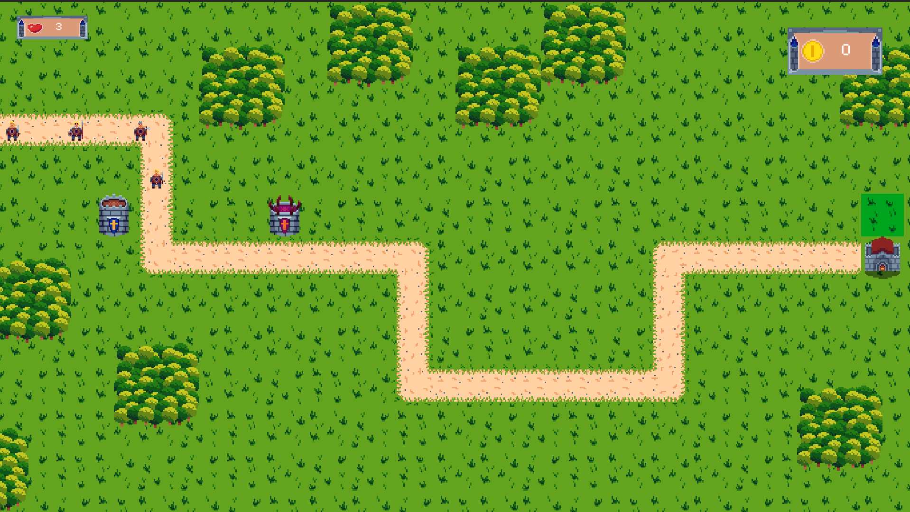
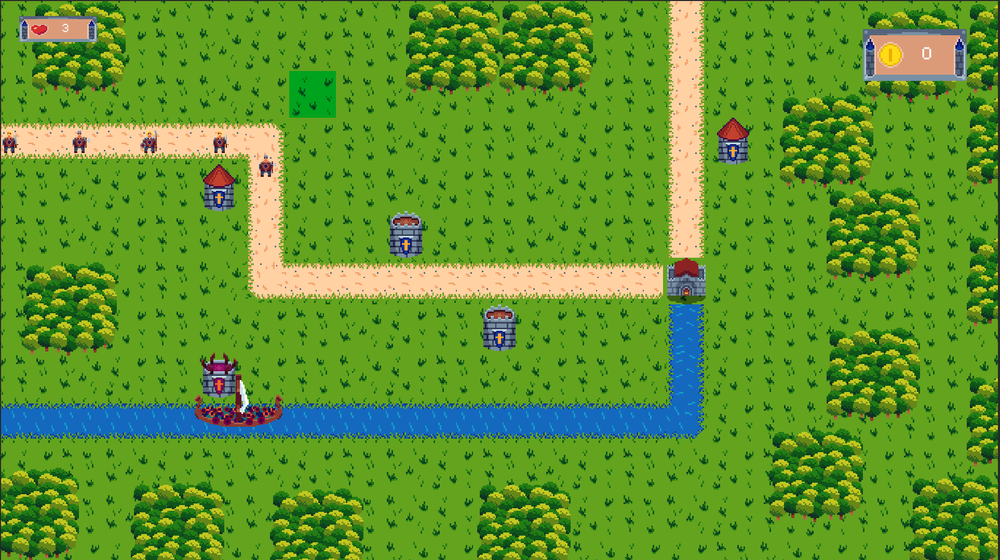
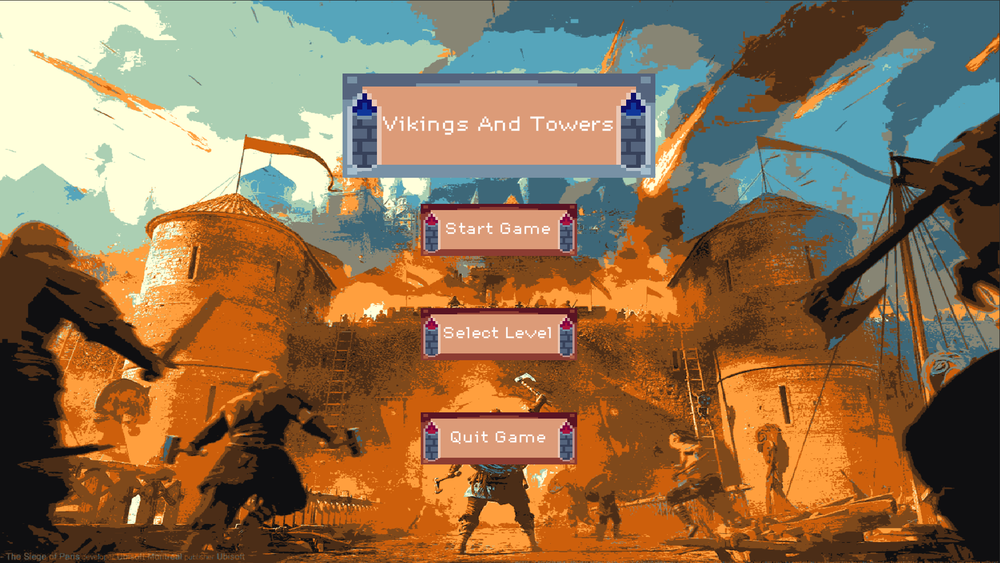
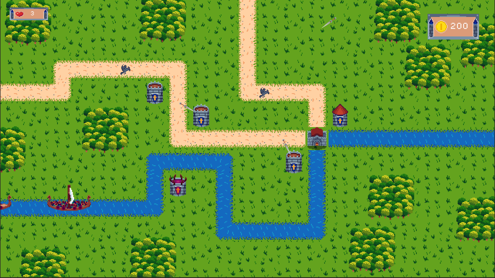
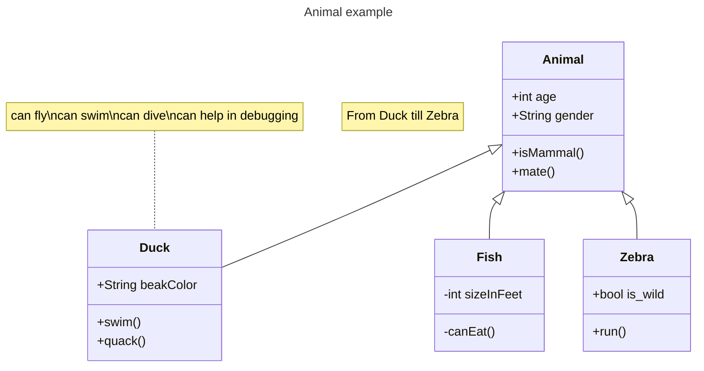

Viking and Towers is een Tower Defence game waar jij de torens plaast om de vikings tegen te houden van het binnen komen in je fort.
je plaast de torens met het geld wat je hebt om meer geld te krijgen moet je de vikings vernietigen. De vikings zullen niet alleen op land komen maar ook via de riviers.

## Product 1: "DRY SRP Scripts op GitHub"

in het wave script werk ik met SRP
[Wave_Script](Tower_Defence_Game/Assets/Scripts/Wave_Scripts/Wave_Script.cs)

in de Tower Script werk ik met DRY
[Tower-Script](Tower_Defence_Game/Assets/Scripts/Tower_Scripts/Towers_Script.cs)

## Product 2: "Projectmappen op GitHub"

dit zijn alle mappen die gerbuik in mijn unity voor dit project. Alles is goed neer gezet zodat het duidelijk is waar alles is
[Project Mappen](Tower_Defence_Game/Assets)

## Product 3: Build op Github

[Vikings And Towers Realse](https://github.com/Luuk-Gunnewijk/SD2B_Tower_Defence_Game/releases/tag/1.0)

## Product 4: Game met Sprites(animations) en Textures 

voor mijn game heb ik alle sprites zelf gemaakt in aseprite en allemaal in unity gezet. voor animaties heb ik sprite sheets gebruikt en voor de single foto's heb ik een sprite gebruikt. ik heb ook een texture zodra de enemies damage nemen.

[Texture](Tower_Defence_Game/Assets/Graphics/Materials/WhiteMat.mat)

## Product 5: Issues met debug screenshots op GitHub 

er zijn verschillende manieren om te debugen. 

Als voorbeeld:

in dit script zie je dat ik bijvoorbeeld debug.log gebruik.
[Main Economy_Script](Tower_Defence_Game/Assets/Scripts/Economy_Scripts/Main_Economy_Script.cs)

ik heb ook draw raycast gerbuikt ook een manier van debugen.
daarmee kon ik makkelijk zien waar de toren naar aan het richten is.

je kan ook manieren gebruiken om de code te stoppen en daar de coden te open om te kijken wat daar gebeurd.

## Product 6: Game design met onderbouwing 

als eerst heb ik een one page gemaakt
[onePage](https://app.milanote.com/1QEZGp1tOjdeaP/one-page)

ik heb ook zelf bedacht van tevoren hoe ik wil dat de game voelt de twee belangrijkste doelen waren om te zorgen dat de stratigichs begint en daarna chaotich word.

*  **Je game bevat torens die kunnen mikken en schieten op een bewegend doel.** 

*Mijn torens hebben ook nog een f.o.v waardoor je pas gaan mikken als enemies in de buurt zijn. ook hebben mijn torens geen 360 graden view maar 90 graden waardoor het een extra uitdaging is voor de speler om de torens ook op de meest tactische manier te roteren.*

*  **Je game bevat vernietigbare vijanden die 1 of meerderen paden kunnen volgen.**  

*Mijn enemies bevatten 3 types: 
1 snelle die ook snel dood gaat. echter als er veel snelle enemies zijn is de kans steeds groter dat ze bij hun doel komen omdat de torens maar 1 enemy tegelijk kan targetten. Het forceert de speler dus om veel goedkope torens te plaatsen.
Ook is er een langzame gepantserde enemy. Deze kan eigenlijk alleen maar worden vernietigd door magische torens die zijn geupgrade. goedkope torens doen bijna geen schade. De speler moet dus een balans gaan zoeken tussen veel goedkope torens en upgraden van torens.
Tot slot is er een vijand die andere enemies healt dit zorgt ervoor dat de speler een extra nadeel heeft en de torens handmatig de deze healer moet laten targetten hierdoor wordt de speler gedwongen om actiever de game te spelen omdat anders geen enkele enemy meer dood gaat.*

*  **Je game bevat een “wave” systeem waarmee er onder bepaalde voorwaarden (tijd/vijanden op) nieuwe waves met vijanden het veld in komen.**

*Onderbouwing hier...*

*  **Een “health” systeem waarmee je levens kunt verliezen als vijanden hun doel bereiken en zodoende het spel kunt verliezen.** 

*Onderbouwing hier...*

*  **Een “resource” systeem waarmee je resources kunt verdienen waarmee je torens kunt kopen en .evt upgraden.**

*Onderbouwing hier...*

*  **Een “upgrade” systeem om je torens te verbeteren.**

*Onderbouwing hier...*

*  **Een “movement prediction” systeem waarmee je kan berekenen waar een toren heen moeten schieten om een bewegend object te kunnen raken. (Moeilijk)**

*Onderbouwing hier...*

## Product 7: Class Diagram voor volledige codebase 

Je brengt je volledige codebase in kaart met behulp van een class diagram. Binnen de classes hoeven geen private members te worden weergegeven. Wel alle public members (fields en methods). Ook geef je indien relevant de relaties tussen je classes weer. Je class diagram plaats je in je readme op github. Evt mag je dit doen m.b.v de [“Mermaid”](https://mermaid.js.org/syntax/classDiagram.html) tool.

## Product 8: Prototype test video
Je hebt een werkend prototype gemaakt om een idee te testen. Omschrijf if je readme wat het idee van de mechanics is geweest wat je wilde testen en laat een korte video van de gameplay test zien. 

## Product 9: SCRUM planning inschatting 

Je maakt een SCRUM planning en geeft daarbij een inschatting aan elke userstory d.m.v storypoints / zelf te bepalen eenheden. (bijv. Storypoints, Sizes of tijd) aan het begin van een nieuwe sprint update je deze inschatting per userstory. 

Plaats in de readme een link naar je trello en **zorg ervoor dat je deze openbaar maakt**

[Link naar de openbare trello](https://trello.com/b/w60wkKSU/examen-paraphrenia)

## Product 10: Gitflow conventions

Je hebt voor je eigen project in je readme gitflow conventies opgesteld en je hier ook aantoonbaar aan gehouden. 

De gitflow conventions gaan uit van een extra branch Develop naast de "Master"/"Main". Op de main worden alleen stabiele releases gezet.

Verder worden features op een daarvoor bedoelde feature banch ontwikkeld. Ook kun je gebruik maken van een hotfix brancg vanaf develop.

Leg hier uit welke branches jij gaat gebruiken en wat voor namen je hier aan gaat meegeven. Hoe vaak ga je comitten en wat voor commit messages wil je geven?

Meer info over het gebruiken van gitflow [hier](https://www.atlassian.com/git/tutorials/comparing-workflows/gitflow-workflow)
